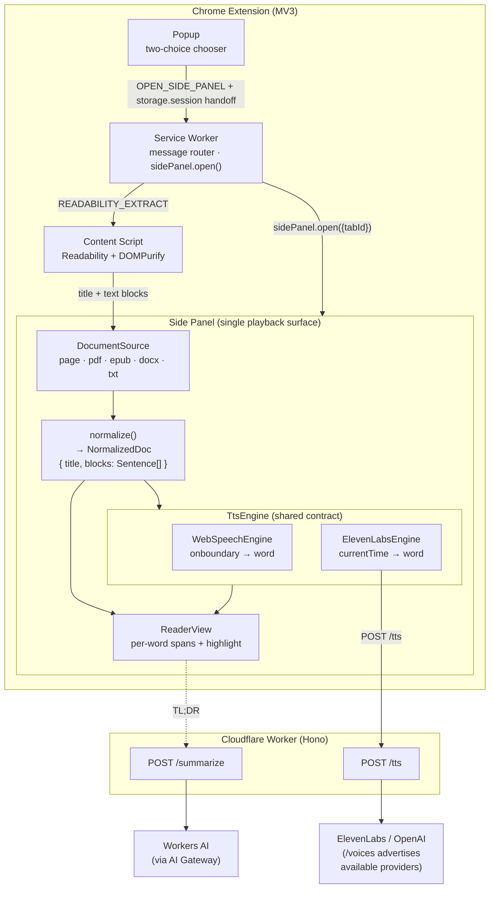

# ReadAloud

> **Listen to any web page or document — with the words highlighted as they're spoken.**

[](https://github.com/gastonche/read-aloud/actions/workflows/ci.yml)
[](LICENSE)


_A portfolio project: a full-stack Chrome extension + Cloudflare Worker, a marketing site, and a motion promo — in one Turborepo._

A Speechify-style **Manifest V3** Chrome extension. **Read this page** drops a
draggable floating bar on the page and highlights the words **right on the page**
as it reads (zero DOM mutation, via the CSS Custom Highlight API); files open in
a rich side-panel reader. It reads the current page or an uploaded file
(**PDF, EPUB, DOCX, TXT**) aloud with real-time **word + sentence highlighting**, adjustable speed, voice selection, **two selectable TTS engines**
(free system voices, or premium neural voices), and an optional AI **TL;DR**
summary.

The interesting part isn't any one feature — it's delivering **one UX (synced
highlighting) on top of two fundamentally different timing models**: event-driven
`onboundary` for system voices, and timestamp-driven audio alignment for neural
voices. That story is told in [Dual-engine highlighting](#dual-engine-highlighting-the-core-story).

---

## Demo

Two ways in, one reader:

- **Read this page** — a draggable control bar drops onto the page and highlights
  each word **on the live DOM** as it speaks (zero DOM mutation).
- **Upload a file** — a PDF / EPUB / DOCX / TXT opens in the side-panel reader with
  the same synced highlighting.

The marketing site lives in [`apps/landing`](apps/landing) (Astro) and a 30-second
motion promo in [`apps/promo`](apps/promo) (Remotion).

## Features

- **Two entry flows, one reader.** A polished popup chooser: _Read this page_
  (Readability extraction of the active tab) or _Upload a file_ (drag-and-drop
  PDF / EPUB / DOCX / TXT). Both converge on the side panel as the single
  playback surface.
- **Synced word + sentence highlighting** on **both** engines, rendered both
  **on the live page** (via the CSS Custom Highlight API) and in the side-panel
  reader — always with **zero DOM mutation** of the source page.
- **Two voice modes, one contract:** **Built-in** (free, on-device
  `speechSynthesis`) and **Studio** (premium neural — **ElevenLabs and/or
  OpenAI**, via a Cloudflare Worker). The backend advertises which voices exist
  based on the API keys it holds (`GET /voices`), so adding voices is a
  backend-only change; the extension renders whatever it gets. Switch live;
  Studio failures auto-fall back to Built-in.
- **A player deck that feels like a product:** a voice rail of avatar chips
  with personality ("Warm & natural"), a play button with a progress ring, a
  vertical speed dial (0.5×–3×), skip ± sentence, click-to-seek, Space-to-play,
  and auto-scroll. Built-in voices are curated to a clean shortlist.
- **Speaks many languages.** Detects the content's language (`chrome.i18n.detectLanguage`), auto-selects a matching system voice (or routes to multilingual Studio), groups voices by language in the picker, renders right-to-left scripts correctly, and lets you correct the detected language from the top bar.
- **On-page reader (v0.2).** "Read this page" shows a **floating, draggable
  control bar** (snaps to 8 dock points) that highlights words on the live
  page — no side panel, no DOM mutation. **Advanced mode** expands into the
  side-panel reader, continuing from the same sentence and settings. Audio and
  Worker calls stay off the page (engines in the page world, /tts proxied via
  the service worker).
- **Sentence-chunked playback** so long documents start instantly.
- **TL;DR** via Cloudflare Workers AI — and the summary reads aloud through the
  same player + highlighting.
- **Graceful failure everywhere:** empty extraction → fallback; unsupported/
  corrupt file → clear message; Worker/neural error → toast + fallback;
  oversized upload → friendly error; unreliable `onboundary` → sentence-level
  highlighting.

## Architecture



### Monorepo (Turborepo)

```
read-aloud/
├── apps/
│   ├── extension/   # Vite 8 + CRXJS + React 19 + Tailwind 4, MV3, TS strict
│   ├── worker/      # Cloudflare Worker (Hono): /summarize, /tts, /voices
│   ├── landing/     # Marketing site — Astro 5 + Tailwind 4
│   └── promo/       # 30s motion promo — Remotion
├── packages/
│   └── shared/      # @readaloud/shared — client↔worker HTTP contract + alignment math
└── turbo.json
```

Two deliberate abstractions carry the whole app:

- **`DocumentSource` → `normalize()` → `NormalizedDoc`.** Every input (page,
  PDF, EPUB, DOCX, TXT) becomes the _same_ `{ title, blocks:
Sentence[] }` shape where each sentence carries its word breakdown with char
  offsets. Playback and highlighting are completely source-agnostic.
  ([types.ts](apps/extension/src/core/document/types.ts))
- **`TtsEngine`.** A single interface both engines implement; the UI is
  engine-agnostic beyond the toggle. ([types.ts](apps/extension/src/core/tts/types.ts))

The popup ↔ service-worker ↔ side-panel **message contract** is defined in
[messaging/contract.ts](apps/extension/src/messaging/contract.ts). Key decision:
the popup stages a "pending source" in `chrome.storage.session` and the side
panel **pulls** it on boot — there's no SW→panel push, which removes the race
where the SW messages a panel document that doesn't exist yet.

## Dual-engine highlighting (the core story)

Both engines satisfy the same contract — a stream of `(sentenceId, wordIndex)`
updates — but they get their timing from completely different places.

### WebSpeechEngine — event-driven (`onboundary`)

`speechSynthesis` speaks one sentence per `SpeechSynthesisUtterance` and fires
`onboundary` events as it crosses word boundaries. Each event carries a
`charIndex` into the spoken text; we map it to a word with a binary-searched
char→word lookup over the sentence's tokens.

- **Pros:** free, fully offline, no network, no audio plumbing.
- **Cons:** boundary support is **voice-dependent** — some voices fire none. We
  detect that and degrade to **sentence-level highlighting**, surfacing a hint.
  Timing is also at Chrome's mercy (the ~15s utterance cutoff is why we chunk by
  sentence).
- One utterance per sentence both dodges that cutoff and lets long docs start
  immediately. A **generation token** invalidates the handlers of any utterance
  we cancel, so seek/rate-change/stop never trigger a stale auto-advance.
  ([web-speech.ts](apps/extension/src/core/tts/web-speech.ts))

### ElevenLabsEngine — timestamp-driven (`currentTime` vs alignment)

The Cloudflare Worker calls ElevenLabs' `/with-timestamps` endpoint, which
returns audio **plus character-level timing**. We:

1. **Collapse** character timings into word spans `{ word, startSec, endSec }`
   by grouping non-whitespace runs (`collapseAlignmentToWords`).
2. Play the audio in an `<audio>` element and, each animation frame, map the
   element's `currentTime` to the active word via a binary-searched
   `wordIndexAtTime`.

- **Pros:** natural, expressive voices; timing is exact (it's measured, not
  estimated), so highlighting is precise.
- **Cons:** costs money, needs the network, adds audio/latency plumbing (we
  prefetch the next sentence while the current plays).
- Because `currentTime` is in **media-seconds**, changing `playbackRate` for
  speed control keeps the alignment valid with **no re-fetch**.
  ([elevenlabs.ts](apps/extension/src/core/tts/elevenlabs.ts))

### Why it's implemented differently per engine

There's no shared timing primitive to unify — one is a push stream of
DOM events, the other is a pull against a media clock. So the contract is drawn
at the **output** (`HighlightState`), not the input. The `ReaderView` renders
that stream knowing nothing about which engine produced it; even the TL;DR
summary is normalized into a doc and read through the exact same path. Adding a
third engine means implementing `TtsEngine` and emitting the same stream —
nothing in the UI changes.

## Cloudflare Worker

Hono app with three environments configured in
[wrangler.toml](apps/worker/wrangler.toml):

| Env             | Run                                | AI backend                                                     |
| --------------- | ---------------------------------- | -------------------------------------------------------------- |
| **development** | `npm run dev -w @readaloud/worker` | real Workers AI via **AI Gateway** (`wrangler login` required) |
| **staging**     | `wrangler deploy --env staging`    | Workers AI `llama-3.1-8b`                                      |
| **production**  | `wrangler deploy --env production` | Workers AI `llama-3.3-70b`                                     |

- `POST /summarize` → Workers AI (`env.AI`), routed through the **AI Gateway**
  for caching/analytics/rate-limiting. The prompt is tuned to deliver the
  content's substance, not meta-describe it.
- `POST /tts` → ElevenLabs `with-timestamps`; the API key is a **Worker secret**
  (`wrangler secret put ELEVENLABS_API_KEY`) and **never reaches the client**.
- **CORS** restricted to `chrome-extension://*` + configured origins; **KV
  fixed-window rate limiter** on both routes; uniform `ApiError` envelope.
- **Offline mock providers** for both routes (deterministic summary; silent-WAV
  - synthetic alignment) so local dev and the test suite run with **no
    Cloudflare or ElevenLabs credentials**.

### Deploying (you provide the account)

```bash
wrangler login
wrangler ai gateway create readaloud                  # → AI_GATEWAY_ID in wrangler.toml
wrangler kv namespace create RATE_LIMIT --env staging # → paste id into wrangler.toml
wrangler secret put ELEVENLABS_API_KEY --env staging  # neural voices
wrangler deploy --env staging
```

Then build the extension pointing at the deployed URL:

```bash
VITE_WORKER_URL=https://readaloud-worker.<acct>.workers.dev npm run build -w @readaloud/extension
```

No secrets are committed; `.dev.vars` is gitignored (see `.dev.vars.example`).

## Cost notes

- **Built-in voices: $0.** `speechSynthesis` runs on-device — no API, no
  network. This is why Built-in is the **default** and Studio is strictly
  **opt-in**.
- **Neural (ElevenLabs / OpenAI):** billed per character (ElevenLabs ~per 1k
  chars; OpenAI TTS at its own per-character rate — and OpenAI returns no word
  timestamps, so the client estimates word timing from the audio duration). A
  typical article (~5k chars) is a few cents; cost scales with reading length,
  which is why neural is behind a toggle and chunked per sentence (you only pay
  for what you actually play). The Worker logs character counts per `/tts` call.
- **TL;DR (Workers AI):** billed per token (input + output) on Cloudflare's
  Workers AI pricing; summaries are short and capped (input truncated to 12k
  chars, output to 512 tokens). The AI Gateway can cache identical requests to
  cut repeat cost.

The deliberate product decision: **default to free, opt into Studio.** Most
reading is fine on Built-in voices; the premium engine is there when voice
quality matters, and it degrades back to free automatically if the Worker is
unreachable.

## Dev setup

Requires Node ≥ 20 (developed on Node 25 / npm 11).

```bash
npm install          # all workspaces
npm run build        # build everything (extension → apps/extension/dist)
npm run typecheck    # tsc --noEmit / astro check across all workspaces
npm test             # vitest — pure logic (93 tests)
npm run dev          # CRXJS dev server (HMR) for the extension
```

### Load the extension

1. `npm run build -w @readaloud/extension`
2. `chrome://extensions` → **Developer mode** on → **Load unpacked** → select
   `apps/extension/dist`. (Manual "Load unpacked" works on current Chrome; only
   the `--load-extension` CLI flag was disabled in Chrome 137+.)
3. The extension defaults to a Worker at `http://localhost:8787`.

### End-to-end tests

The harness drives the **real built extension in Playwright's bundled Chromium**
(required — Chrome 137+ disabled CLI extension loading) and boots an offline
Worker for the milestones that need it:

```bash
npm run e2e -w @readaloud/extension     # builds, boots mock Worker, runs all 11 smokes
```

Headless Chromium has no system voices and won't play audio, so the suite
injects a fake `speechSynthesis` / `Audio` to drive the engines deterministically
— the engine logic itself is unit-tested with mock backends. Screenshots land in
`apps/extension/e2e/screenshots/`.

## CONTRIBUTING

- **Stack:** TypeScript **strict** (`noUncheckedIndexedAccess`,
  `exactOptionalPropertyTypes`, no `any` in core logic), React 19, Tailwind 4,
  Hono, Vitest, Playwright.
- **Where things go:** pure, framework-free logic in `apps/extension/src/core/*`
  (so it's unit-testable in Node); browser/`chrome.*` glue at the edges
  (`browser-backend.ts`, `browser-neural.ts`, the content script, the SW). The
  pdf.js-importing code is isolated from the routing logic for the same reason.
- **Testing rule of thumb:** pure logic → Vitest; anything touching the real
  browser → the Playwright E2E harness. Add a `m<N>-smoke.mjs` per feature and
  register it in `e2e/run-all.mjs`.
- **Before a PR:** `npm run typecheck && npm test && npm run format:check`, and
  `npm run e2e -w @readaloud/extension` if you touched the extension.
- **Secrets:** never commit them. Worker secrets go through
  `wrangler secret put`; `.dev.vars` is gitignored.

## Known limitations

- **System-voice word timing is voice-dependent.** Voices that don't fire
  `onboundary` get sentence-level highlighting (with a UI hint).
- **Neural word ↔ display word alignment** assumes ElevenLabs' whitespace-split
  words line up 1:1 with the reader's tokens; heavy hyphenation or text
  normalization (e.g. numbers → words) can drift a word.
- **Sentence segmentation** uses ICU (`Intl.Segmenter`) with the detected
  content language, so CJK/Thai word breaking works — but ICU has no
  abbreviation dictionary, so "Dr. Smith" still splits after "Dr.".
- **PDF** extraction is text-only (no OCR for scanned PDFs) and reconstructs
  paragraphs heuristically from text-item EOL flags.
- **EPUB / DOCX** extraction is text-only (no images, footnotes, or complex
  tables); DRM-protected EPUBs can't be read. EPUB is parsed via the OPF spine
  with JSZip rather than epub.js's renderer — more reliable for headless text.
- **Uploads** are capped at 6 MB (the `chrome.storage.session` handoff budget).
- **Restricted pages** (`chrome://`, the Web Store, the PDF viewer) can't be
  read; the extension says so instead of failing silently.

## What I'd do at scale

- **Streaming neural TTS** (chunk audio as it's generated) to cut
  time-to-first-word, instead of awaiting the whole sentence clip.
- **Cache** ElevenLabs audio + alignment in **R2/KV** keyed by `(voice, text
hash)`, and Workers-AI summaries in the **AI Gateway** — repeat reads become
  free and instant.
- **On-demand content-script registration** (`chrome.scripting.registerContentScripts`)
  instead of declaring it on `<all_urls>`, so Readability isn't loaded into every
  page.
- **Durable Object** rate limiting (precise, per-user) instead of the
  fixed-window KV counter, plus auth so quotas are per-account.
- **Larger uploads** via chunked transfer to an offscreen document / IndexedDB
  rather than the storage.session base64 path.
- **Observability:** structured logs → Workers Analytics Engine for cost and
  latency dashboards; client error reporting.
- **Better segmentation:** an abbreviation-aware sentence splitter, and aligning
  neural highlighting on character offsets to fully eliminate the word-drift
  edge case.

## License

[MIT](LICENSE) © Gaston
